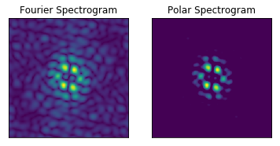
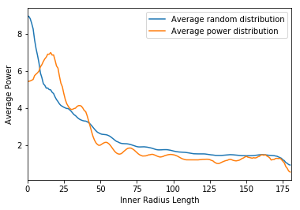

# Classification of Medial Entorhinal Units

[Grid cells](http://www.scholarpedia.org/article/Grid_cells) are neurons in the [medial entorhinal cortex](http://www.scholarpedia.org/article/Entorhinal_cortex) (MEC) that are activated when the subject passes through multiple locations arranged in a hexagonal grid. Grid cells, along with other cells in the MEC such as head direction and speed cells, form circuits with place cells to create a comprehensive positioning system in the brain.

This project therefore attempts to provide a classification system to identify grid cells located in the medial entorhinal cortex in order to better understand the navigational building blocks necessary for important memory processes. 

## Features

### Canonical Grid Scoring

Performs the established grid scoring methods, which includes analyzing the periodicity of the autocorrelation matrix's correlation curve. 

### Two-Dimensional Fourier Transformation Scoring

Extracts any significant periodict patterns from the firing rate map by utilizing the properties of two-dimensional Fourier transformations. 

### Average Annulus Power Component Identification

Identifies significant contributing components of the Fourier spectrogram by calculating the distribution of the average power of pixels within a defined annulus of various radial lengths and comparing this to the random distribution.

## Requirements

* python
* math
* numpy
* scipy
* matplotlib

## Citations

Neuronal data was downloaded from the [Kavli Institue for Systems Neuroscience](https://www.ntnu.edu/kavli/research/grid-cell-data) Sargolini et al 2006 data set. 

